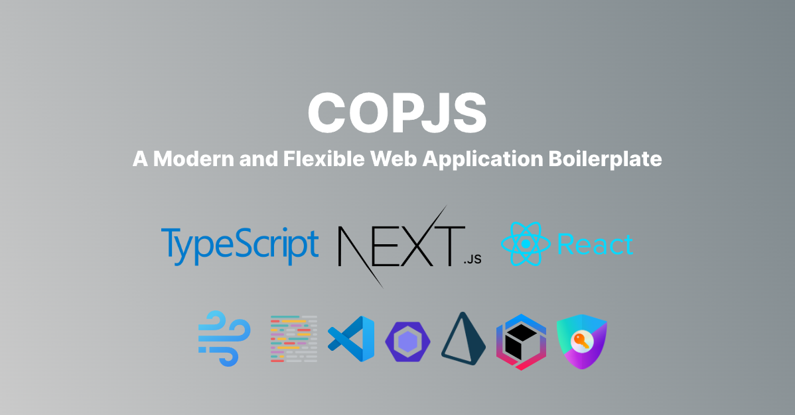

# 🔥 CopJS - A Modern and Flexible Web Application Boilerplate

  

Build web applications that are scalable, efficient and user-friendly with CopJS. The boilerplate is designed with the latest technologies including [TypeScript](https://www.typescriptlang.org/), [React](https://reactjs.org/), [Next.js](https://nextjs.org/), [Turbo](https://turbo.build/), [Prisma](https://www.prisma.io/), and more. With a built-in theme provider for dark mode and absolute imports, your application will have a sleek and modern feel.

## Dependencies

- [TypeScript](https://www.typescriptlang.org/): 💻 A statically typed, object-oriented programming language that builds on JavaScript.
- [Next.js](https://nextjs.org/): 🚀 A framework for building server-rendered or statically-generated React applications.
- [Turbo](https://turbo.build/): 🏋️‍♀️ High-performance build system for JavaScript and TypeScript codebases.
- [Prisma](https://www.prisma.io/): 🗄️ A powerful and flexible database toolkit that makes it easy to work with databases in your application.
- [Next-Auth](https://next-auth.js.org/): 🔒 A complete authentication solution for Next.js that supports multiple providers and local authentication.
- [Next-i18next](https://next.i18next.com/): 🌍 An internationalization (i18n) library for Next.js that makes it easy to translate your application.
- [Windicss](https://windicss.org/): 🎨 A modern and customizable styling solution for Next.js applications.
- [Storybook](https://storybook.js.org/): 📚 Storybook is a frontend workshop for building UI components and pages in isolation.

## Developer Experience

- 💅 [Classnames](https://www.npmjs.com/package/classnames) A utility for conditionally joining class names together.
- 📏 [Eslint](https://eslint.org/) Linter (default NextJS, NextJS Core Web Vitals)
- 💖 [Prettier](https://prettier.io/) Code Formatter
- 🦊 Husky for Git Hooks
- 🚫 Lint-staged for running linters on Git staged files

## Features

- 🌗 Dynamic Theme Provider for Dark Mode
- 📂 Seamless Absolute Imports using @ Prefix
- 🗂 Customized VSCode Configuration for Better Coding Experience
- 🤖 Improved SEO with Next SEO for metadata, JSON-LD, and Open Graph tags
- 🗺️ Automatic Generation of Sitemap.xml and robots.txt with next-sitemap
- 🕰️ Activity tracking with Timestamps added to the Prisma schema
- 🚫 Custom 404 and 500 error pages for improved user experience
- 🔑 User Role Management using next-auth and Prisma with extended session types
- 🛡️ Protected API routes with user role management
- 🔐 User authentication with NextAuth and CredentialsProvider for Sign-In and Sign-Up functionality
- 🔒 Custom Sign-In and Sign-Up Page
- 🚫 Custom Error Messages for NextAuth Providers
- 🔒 Multiple Accounts with the Same Email Address

## Built-in Advantages from Next.js

- 🔥 Minimized HTML & CSS
- 💥 Live Reload
- 💯 Cache Busting Guarantee

## Philosophy

- 🌟 All pages are statically generated by default, with the option to switch to SSR by adding `getServerSideProps` to a page.
- 🔧 The code is minimal, giving you the freedom to make necessary adjustments to fit your needs and preferences.
- 🚀 Production-ready and SEO-friendly

## Getting Started 🚀

Clone the CopJS repository by running the following command in your terminal:

<pre>git clone https://github.com/caglarop/copjs.git</pre>

Navigate into the cloned repository:

<pre>cd copjs</pre>

Install the dependencies by running the following command:

<pre>yarn</pre>

Configure the environment variables by creating a .env file in the root directory and setting the necessary values.

And then sart the development server by running the following command:

<pre>yarn dev</pre>

## Contributors 🤝

Contributions are welcome! If you have an idea for a new feature or find a bug, please open an issue or submit a pull request. 🙏

## License 📄

The CopJS boilerplate is open-source software licensed under the [MIT License](LICENSE). 🎉
